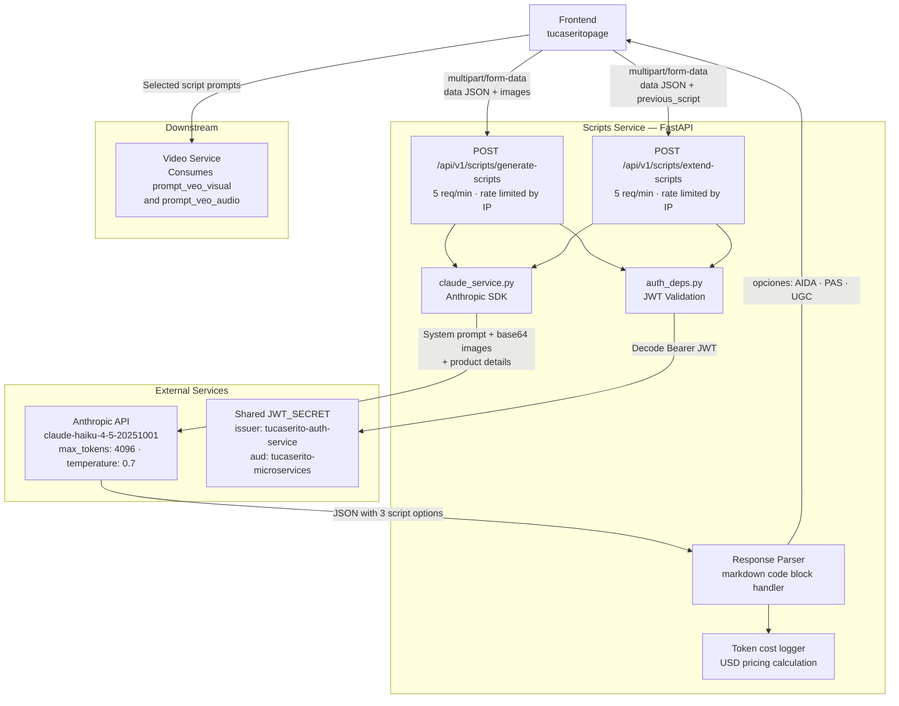

# Tu Caserito — Scripts Service

## Overview

The Scripts Service is the creative engine of the Tu Caserito platform. It receives a product name, description, optional reference images, and user style preferences, then calls **Claude** (`claude-haiku-4-5-20251001`) to generate three distinct video ad script options — one per marketing copywriting strategy: AIDA (Attention–Interest–Desire–Action), PAS (Problem–Agitate–Solution), and UGC (User-Generated Content style). Each script includes a narration text capped to Veo's timing constraints, a visual direction prompt, and an audio/music prompt — all ready to feed directly into the Video Service's Veo 3.1 pipeline. A second endpoint generates 7-second continuation scripts for already-rendered videos.

---

## Architecture



---

## Tech Stack

| Layer | Technology |
|---|---|
| Framework | FastAPI 0.115.6 |
| Server | Uvicorn 0.34.0 |
| AI Model | Anthropic SDK 0.42.0 — `claude-haiku-4-5-20251001` |
| Rate Limiting | SlowAPI (per-IP) |
| JWT Validation | PyJWT |
| Validation | Pydantic 2.10.4 · `pydantic-settings` 2.7.1 |
| Config | `python-dotenv` 1.0.1 |
| Deployment | Vercel (serverless) |

---

## Environment Variables

| Variable | Required | Description |
|---|---|---|
| `CLAUDE_API_KEY` | Yes | Anthropic API key for Claude |
| `JWT_SECRET` | Yes | Shared JWT signing secret — must match the Auth Service |
| `ALLOWED_ORIGINS` | Optional | JSON array of allowed CORS origins (default: `["https://www.tucaserito.com"]`) |

> **Security policy:** Never commit `.env` or any secrets to version control. Use `.env.example` as the reference template.

---

## API Endpoints

All endpoints require `Authorization: Bearer <access_token>`.

---

### `POST /api/v1/scripts/generate-scripts`

Generates three video ad scripts (AIDA, PAS, UGC) from a product description and optional reference images. Scripts are timed for 8-second video generation (max ~20 words of narration).

**Rate limit:** 5 requests / minute (per IP)

**Request:** `multipart/form-data`

| Field | Type | Description |
|---|---|---|
| `data` | JSON string | Product info and preferences (see schema below) |
| `images` | File(s) | Up to 3 images — JPEG, PNG, or WebP · max 5 MB each |

`data` field JSON schema:
```json
{
  "product_name": "string",
  "product_description": "string",
  "technical_settings": {
    "aspect_ratio": "9:16"
  },
  "preferences": {
    "video_style": "string",
    "music_genre": "string",
    "custom_theme": "string"
  }
}
```

**Response `200 OK`:**
```json
{
  "opciones": [
    {
      "id": 1,
      "nombre_estrategia": "AIDA",
      "texto_locucion": "Up to 20 words of narration text",
      "prompt_veo_visual": "English visual direction for Veo model",
      "prompt_veo_audio": "English audio/music direction with Spanish dialogue"
    },
    {
      "id": 2,
      "nombre_estrategia": "PAS",
      "texto_locucion": "...",
      "prompt_veo_visual": "...",
      "prompt_veo_audio": "..."
    },
    {
      "id": 3,
      "nombre_estrategia": "UGC",
      "texto_locucion": "...",
      "prompt_veo_visual": "...",
      "prompt_veo_audio": "..."
    }
  ]
}
```

**Error responses:** `400` (invalid image type/size, >3 images), `401` (invalid JWT), `429` (rate limit exceeded)

---

### `POST /api/v1/scripts/extend-scripts`

Generates three 7-second continuation scripts for an existing video. Narration is capped at ~17 words to match the shorter duration.

**Rate limit:** 5 requests / minute (per IP)

**Request:** `multipart/form-data`

| Field | Type | Description |
|---|---|---|
| `data` | JSON string | Product info plus `previous_script` context (see schema below) |
| `images` | File(s) | Optional reference images (same constraints as above) |

`data` field JSON schema:
```json
{
  "product_name": "string",
  "product_description": "string",
  "previous_script": {
    "id": 1,
    "nombre_estrategia": "AIDA",
    "texto_locucion": "Previous video narration text",
    "prompt_veo_visual": "Previous visual prompt",
    "prompt_veo_audio": "Previous audio prompt"
  },
  "technical_settings": {
    "aspect_ratio": "9:16"
  },
  "preferences": {
    "video_style": "string",
    "music_genre": "string",
    "custom_theme": "string"
  }
}
```

**Response `200 OK`:** Identical structure to `generate-scripts`. The three options represent different continuation/closing strategies.

---

## How to Run Locally

### Prerequisites
- Python 3.11+
- An [Anthropic API key](https://console.anthropic.com/)
- JWT secret matching the Auth Service

### Steps

```bash
# 1. Navigate to the service directory
cd tucaserito_scripts_service

# 2. Create and activate a virtual environment
python -m venv venv
source venv/bin/activate     # macOS / Linux
venv\Scripts\activate        # Windows

# 3. Install dependencies
pip install -r requirements.txt

# 4. Configure environment variables
cp .env.example .env
# Edit .env and fill in:
#   CLAUDE_API_KEY=<your-anthropic-api-key>
#   JWT_SECRET=<same-secret-as-auth-service>
#   ALLOWED_ORIGINS=["http://localhost:3000"]

# 5. Start the development server
uvicorn app.main:app --reload --port 8002
```

The service will be available at `http://localhost:8002`.  
Interactive API docs: `http://localhost:8002/docs`

> **Note on video timing:** The Claude system prompt enforces strict word limits derived from Veo 3.1's timing model — ~20 words for 8-second base videos, ~17 words for 7-second extensions. These are not arbitrary limits; they are mathematically calculated to match the speech rate that Veo's audio generation expects.
